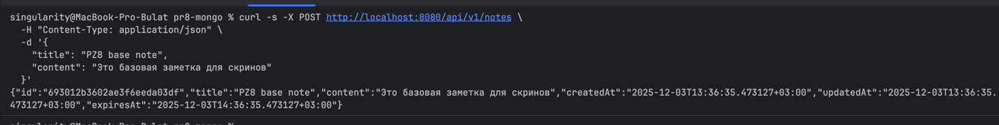
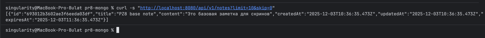
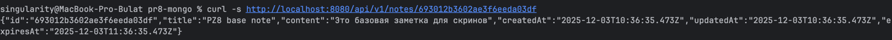
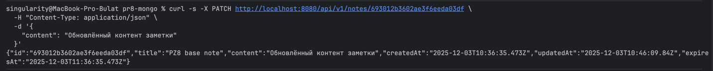
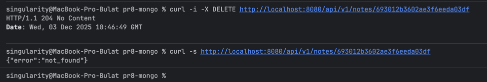
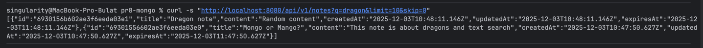
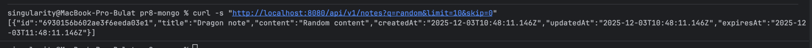
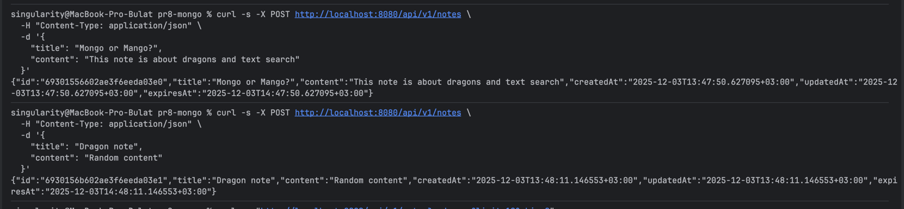
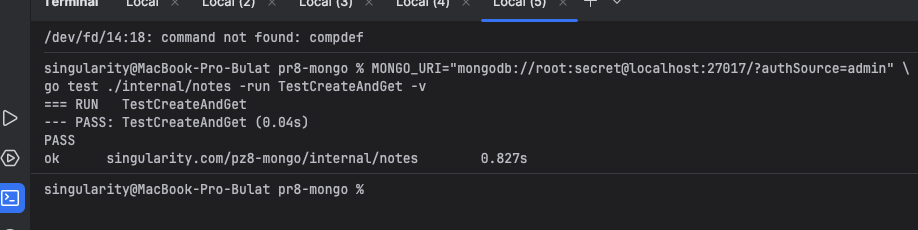

# Практическая работа #8
## Работа с MongoDB: подключение, создание коллекции, CRUD-операции
## Саттаров Булат Рамилевич ЭФМО-01-25

---
## Требования
- Go **≥ 1.21**
- Docker и Docker Compose
- `curl` **или** любой HTTP-клиент (Postman и т.п.)

## Команды запуска
Запуск контейнера
``` bash

docker compose up -d
```
Копирование файл с примером переменных окружения:

``` bash

cp .env .env
```

Запуск:
``` bash

go run ./cmd/api
```

## Скриншоты

- POST /notes создание заметки



- GET /notes получение списка заметок



- GET /notes/{id} получение по id



- PATCH /notes/{id} обновление заметки



- DELETE /notes/{id} удаление заметки



## Доп задания
- Текстовый поиск по search




- Поле expiresAt - TTL индекс



## Тестирование

